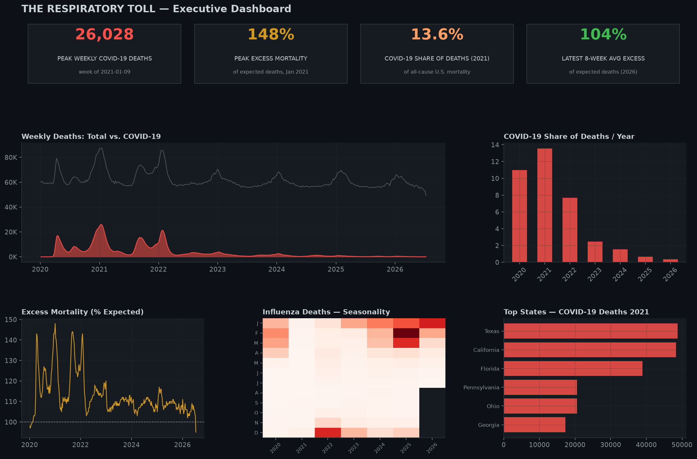

# The Respiratory Toll: COVID-19, Pneumonia & Influenza Mortality in the U.S. (2019–2026)

End-to-end analysis of six years of CDC NCHS provisional weekly mortality surveillance data, covering COVID-19, pneumonia, and influenza deaths across the United States.

## Overview

This project follows the **PACE framework** (Plan, Analyze, Construct, Execute) to answer a set of public-health questions using CDC's weekly death-count surveillance data:

- How did weekly U.S. deaths from COVID-19, pneumonia, and influenza evolve across six years, and where were the pandemic waves?
- How much of total mortality did COVID-19 account for in each year, and how has that share collapsed since 2021?
- Did influenza and pneumonia seasonality "return" once COVID-19 activity declined (the immunity-debt hypothesis)?
- Which U.S. states carried the heaviest COVID-19 mortality burden during the deadliest year?
- Can excess mortality (% of expected deaths) be predicted from a week's death composition and calendar position?

## Dataset

**Source:** CDC NCHS — *Provisional COVID-19, Pneumonia, and Influenza Deaths*
**Grain:** Weekly death counts by U.S. state (plus national total), Dec 2019 – Jul 2026
**Rows:** 23,220 | **Columns:** 17

Key columns: `Week Ending Date`, `State`, `COVID-19 Deaths`, `Total Deaths`, `Percent of Expected Deaths`, `Pneumonia Deaths`, `Influenza Deaths`, `Pneumonia, Influenza, or COVID-19 Deaths`.

## What's Inside the Notebook

1. **Data cleaning** — comma-formatted numeric strings, datetime parsing, small-cell-count suppression handling, and exclusion of reporting-incomplete recent weeks.
2. **Exploratory analysis** — national weekly trend with pandemic-wave annotations, excess-mortality (% of expected deaths) tracking, flu/pneumonia seasonality heatmaps, COVID-19's shrinking share of total mortality, a correlation matrix, and a state-level burden comparison.
3. **Feature engineering** — cyclical calendar encoding, lag features, and rolling averages.
4. **Modeling** — a Linear Regression baseline vs. a Random Forest Regressor, evaluated on a chronological (non-leaky) train/test split, predicting weekly excess mortality.
5. **Explainability** — SHAP feature-importance analysis of the Random Forest.
6. **Findings, recommendations, and limitations** — written for a public-health/analytics audience.

## Tech Stack

`pandas` · `numpy` · `matplotlib` · `scikit-learn` · `shap`

## Key Results

| Metric | Finding |
|---|---|
| Deadliest COVID-19 week | Jan 9, 2021 — 26,028 deaths |
| Peak COVID-19 mortality share | 13.6% of all U.S. deaths (2021) |
| Model comparison | Random Forest outperforms Linear Regression baseline on held-out chronological test weeks |
| Top SHAP driver | Recent COVID-19 / combined pneumonia-COVID death levels |

## Limitations

- NCHS suppresses cell counts of 1–9 for privacy, slightly biasing low-incidence periods.
- State comparisons use raw death counts, not per-capita rates (population data not included in source file).
- The forecasting model is a directional proof of concept (~340 weekly observations), not a validated epidemiological forecasting tool.

## Author

**Zohair Baloch** — Independent Data Analyst
[Kaggle](https://www.kaggle.com/zohairbaloch) · [GitHub](https://github.com/zohairbaloch-64) · [LinkedIn](https://www.linkedin.com/in/zohair-baloch-data-analyst)
